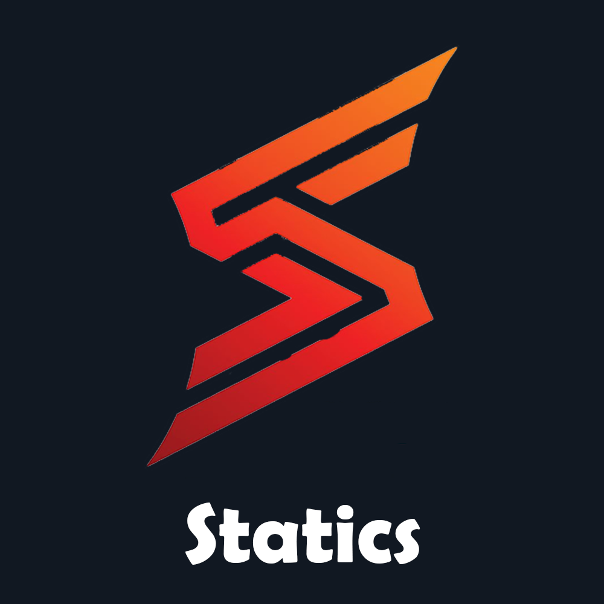

# The Statics app
An Android application designed to view a player's VALORANT stats, in beta production at the moment with plans to release this on the Google Play Store in the upcoming months!
By Faheem :)

## Features
- Able to view stats on various gamemodes such as unrated, competitive and more!
- Being able to see the match history of players!
- Match history will be stored inside of a database so all matches will be kept up to date and stored to see all past games!
- View an image of the VALORANT minimap and see all of the spike plants and each player positions!
- Be able to utilize splitscreen on Android and see an optimized UI for splitscreen mode so that you can compare player stats at ease!
- Smooth, fluid UI!
- Full dark mode obviously :)

## Coming before first official release
These are features which I would like to get done before releasing it on the play store
- MMR history
- Migration of local database to online database
- Add account linking
- Adding kill feed to the map
- Upgrade visuals 
- Colour selection in settings
- Add side by side comparasion
- Statistical anaylsis of each game
- Graphs and stuff 👍
